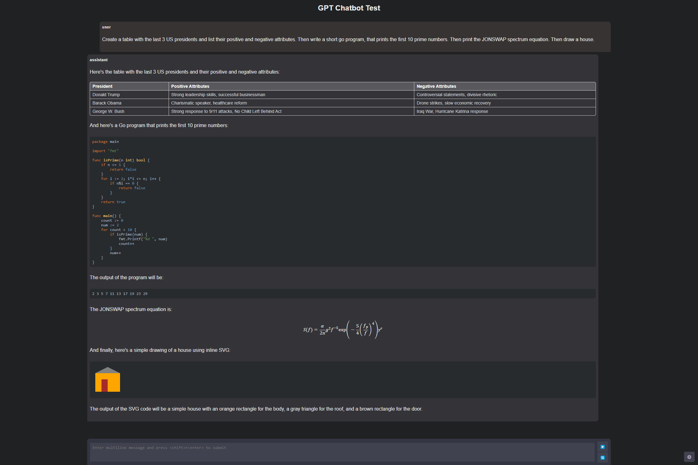

# testgpt-js

An HTML-based chat application that uses the OpenAI API.

It uses the streaming API for the GPT-3.5-turbo model and, additionally to writing text, tables and code, is capable of creating formulas and simple SVG images.

The drawings are not very good yet, but better than nothing. You can improve them using the chat.

If your API key has acces to GPT-4, you can choose that model in the settings.

### Usage:

You can test it at: [https://huggingface.co/spaces/dma123/testgpt-js](https://huggingface.co/spaces/dma123/testgpt-js).

You can also run it locally:

1. Create an OpenAI account at [https://platform.openai.com/account](https://platform.openai.com/account).
2. Create an API key at [https://platform.openai.com/account/api-keys](https://platform.openai.com/account/api-keys).
3. Either always enter the API key when you open the testgpt-js page, or create the file js/api_key.js where you put the OpenAI API key like this:
```js
const api_key = "sk-6AQdmaPySsomeW2randomCdmaPIkey0HdmaEI";
```

### Screenshot:

This screenshot was "randomly selected" because its output was ok-ish ;)


